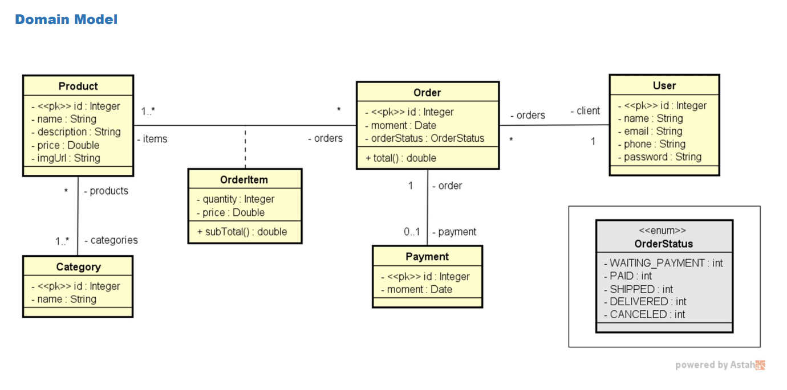

# workshop-springboot3-jpa

## Projeto WEB Services com Spring Boot e JPA / Hibernate 🔥
> Um dos projetos do [curso de java da Udemy](https://www.udemy.com/share/101scA3@OO655ylH0IslNYuiF2MElBavFc-wPTs3ldPKhGbsdkc4jab-fwO-Dp8irvUuCuKrOw==/). Foi implementado seguindo os passos do curso e aplicando os conteúdo passados.

### Tecnologias ⚙️

1. Spring Boot
2. Apache Tomcat
3. Maven
4. DataBase H2
5. Insomnia
6. Postgres
7. Git

### Objetivos ✅

- Criar projeto utilizando Spring Boot Java.
- Implementar modelo de domínio.
- Estruturar camadas lógicas: resource, service, repository.
- Configurar banco de dados de teste (H2).
- Povoar o banco de dados (Seeding).
- CRUD - Create, Retrieve, Update, Delete.
- Tratamento de exceções.
- Estudar tecnicas e padrões como injeção de depência, divisão de responsabilidade, programação defensiva, Criação de perfis no SpringBoot e Utilização da interface JPA através do HIBERNATE.

### Modelo de Domínio 🗺️

